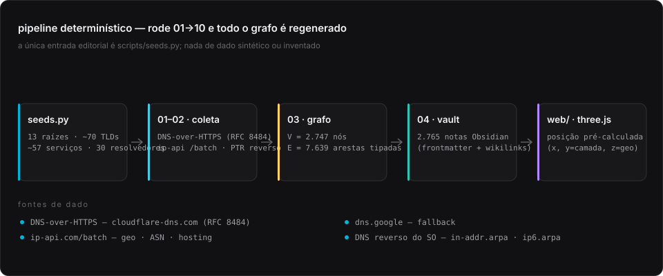
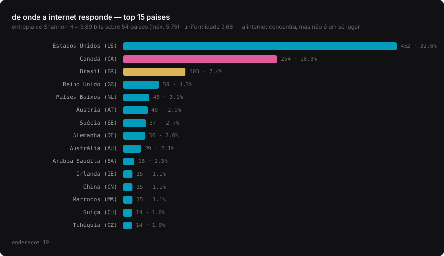
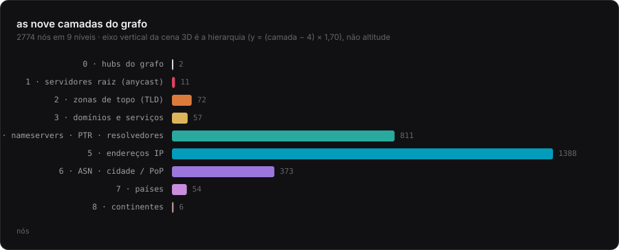
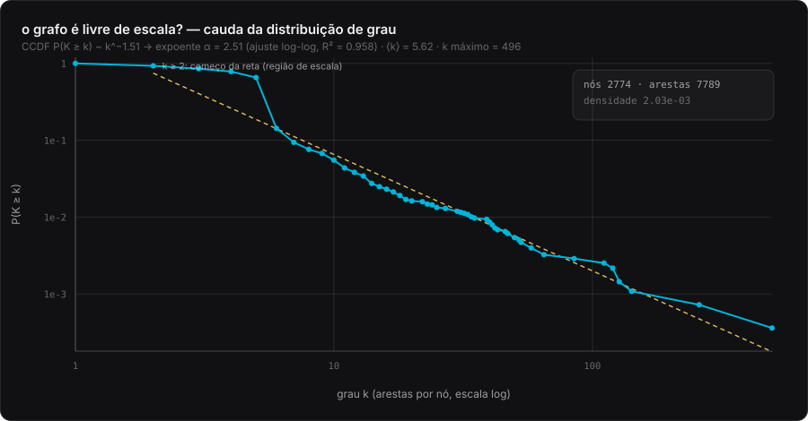
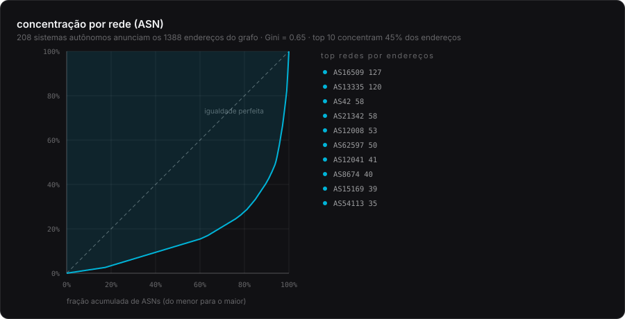
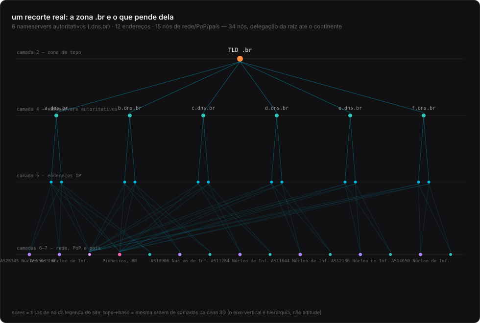
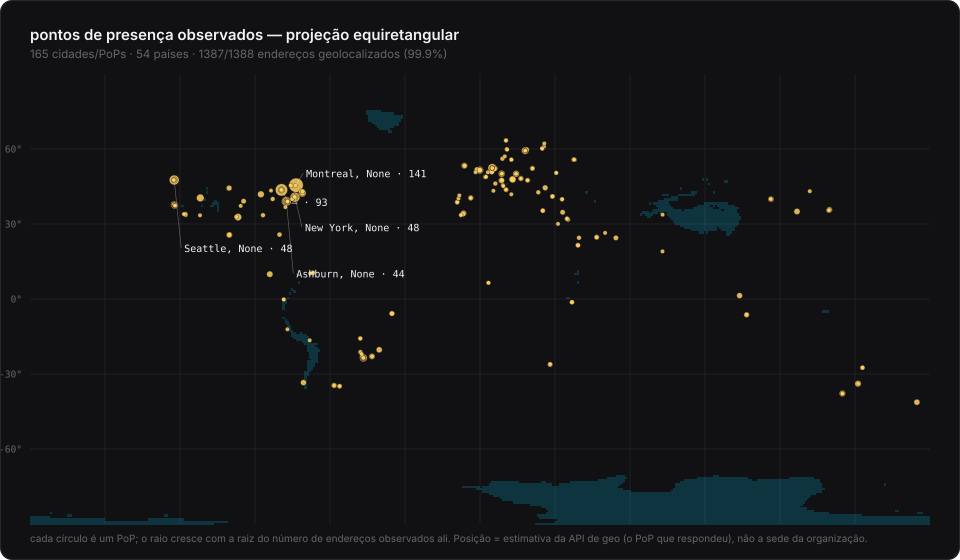

# Onde a internet mora — guardar infraestrutura de internet como grafo

**DNS × geografia**: a árvore de nomes da internet (zona raiz → TLD → nameserver →
endereço IP → ASN → cidade → país) coletada ao vivo, normalizada como grafo tipado,
navegável como vault Obsidian e renderizável como cena 3D.

Idealizado e desenvolvido por **Diego Duenhas (dduenhas)**.

[](LICENSE)
[](scripts)
[-00b4d8)](#reprodutibilidade)
[](#coleta-e-proveni%C3%AAncia)
[](web)
[](https://dns-geo-graph.vercel.app)

> **Coleta de 2026-09-23T21:21:51-0300** — 2.774 nós · 7.789 arestas ·
> 1.388 endereços IP (745 IPv4 · 643 IPv6) ·
> 54 países · 165 PoPs · 208 sistemas autônomos ·
> 1.483 consultas DNS reais.

---

## Sumário

- [A ideia](#a-ideia)
- [Como funciona](#como-funciona) · [coleta e proveniência](#coleta-e-proveni%C3%AAncia)
- [Os números](#os-números)
- [O grafo por dentro](#o-grafo-por-dentro) · [a geografia](#a-geografia)
- [O site 3D](#o-site-3d) · [o vault Obsidian](#o-vault-obsidian)
- [Para que serve](#para-que-serve)
- [Fundamentos teóricos](#fundamentos-teóricos)
- [Limitações](#limitações-tecnológicas-e-conceituais)
- [Pontos negativos e melhorias futuras](#pontos-negativos-e-melhorias-futuras)
- [Reprodutibilidade](#reprodutibilidade) · [estrutura do repositório](#estrutura-do-reposit%C3%B3rio)
- [Créditos, licença e citação](#cr%C3%A9ditos-licen%C3%A7a-e-como-citar)

---

## A ideia

Quase todo sistema que guarda informação sobre a internet guarda-a **em linhas**:
uma tabela de hosts, uma zona de DNS, uma planilha de inventário. Cada linha é
autossuficiente e o sentido mora dentro dela. **Este projeto faz o contrário: guarda
a internet como grafo** — as entidades são *nós* e o significado mora nas *arestas*.

A consequência é filosófica antes de ser técnica. Se a identidade de um dado é o nó
e não a linha, então:

1. **A hierarquia deixa de ser pasta e passa a ser aresta tipada.** `TLD .br →
   a.dns.br` (delegação de autoridade) e `a.dns.br → 200.219.148.10` (resolução de
   nome, outro tipo de relação) convivem no mesmo nó sem virar duas tabelas.
2. **Consultar é navegar.** Não existe `JOIN`: caminha-se de nó em nó — do país até
   a zona raiz, ou da raiz até o continente onde aquele endereço responde.
3. **O vazio é informação.** Um nó sem aresta de DNS é pendurado num hub com a
   aresta `sem aresta DNS direta`: a ausência fica registrada em vez de escondida.

O objeto de estudo é uma pergunta simples e antiga: **onde a internet mora?**
A resposta literal do projeto é: em 165 PoPs de 54 países,
anunciados por 208 sistemas autônomos, atrás de 594
nameservers autoritativos — mas o mapa só é legível porque a estrutura está montada
como grafo, e não como lista.

### As três camadas de saída

| camada | forma | para quê |
|---|---|---|
| **dados** | JSON, CSV, GraphML | reuso: qualquer ferramenta que leia grafo (Gephi, yEd, Cytoscape, networkx) |
| **vault** | 2.792 notas Markdown com frontmatter e wikilinks | leitura humana com backlinks, filtros e Graph View no Obsidian |
| **site** | página estática three.js | leitura espacial: hierarquia no eixo Y, geografia no plano |

---

## Como funciona



<sub>Pipeline: uma única entrada editorial (seeds.py) e dez passos idempotentes.</sub>

| passo | script | o que faz | saída |
|---|---|---|---|
| 1 | `01_collect_dns.py` | consulta A/AAAA/NS dos 13 servidores raiz, dos TLDs semente e dos serviços semente via DoH | `data/raw/dns_records.json` |
| 2 | `02_geolocate.py` | geolocaliza cada endereço único (100 por requisição, respeitando 15 req/min) | `data/raw/geo.json` |
| 2b | `02b_collect_ptr.py` | DNS reverso real (`in-addr.arpa` / `ip6.arpa`) em 32 threads | `data/raw/ptr.json` |
| 3 | `03_build_graph.py` | normaliza tudo em V e E tipados, deduplica, calcula estatísticas e as posições 3D | `nodes/edges/hosts.csv/graph.graphml/graph_core.json` |
| 4 | `04_build_vault.py` | escreve o vault Obsidian: 1 nota por nó, MOCs, notas de teoria, backlinks | `grafo/` |
| 5 | `05_write_readme.py` | regenera **este README** com os números da coleta (nada digitado à mão) | `README.md` |
| 6 | `06_validate_vault.py` | auditoria do vault: links quebrados, duplicados, órfãos, frontmatter | relatório no stdout |
| 7 | `07_export_web_data.py` | copia os dados para dentro do diretório de deploy e sincroniza as contagens em texto do `index.html` | `web/data/`, `web/index.html` |
| 8 | `08_make_figures.py` | gera as figuras SVG deste README (sem dependências externas) | `docs/img/*.svg` |
| 9 | `09_fetch_fonts.py` | baixa e auto-hospeda as famílias tipográficas | `web/assets/fonts/` |
| 10 | `10_write_deploy_config.py` | deriva a CSP (com hash do import map) e os cabeçalhos de deploy | `vercel.json`, `web/_headers` |

Tudo é **idempotente e determinístico**: rodar 01→10 duas vezes produz os mesmos
arquivos (as posições 3D dos nós sem geografia usam CRC32, não o `hash()` do Python,
que é salgado por processo).

### Coleta e proveniência

| dado | fonte | autenticação | observação |
|---|---|---|---|
| A · AAAA · NS | `cloudflare-dns.com/dns-query` (**primário**) e `dns.google/resolve` (fallback) — DNS-over-HTTPS, [RFC 8484](https://www.rfc-editor.org/rfc/rfc8484) | nenhuma | sem resolvedor local no caminho |
| PTR | DNS reverso do sistema (`in-addr.arpa` / `ip6.arpa`), 32 threads | nenhuma | o `/batch` da ip-api não devolve `reverse`; o DNS reverso é autoritativo |
| país, cidade, ASN, ISP, hosting | `ip-api.com/batch` — 100 IPs por requisição, 15 req/min | nenhuma | free tier responde em HTTP; dá para apontar para um endpoint TLS com `IPAPI_BATCH_URL` |

Nada é inventado, amostrado ou sintetizado: **cada nó do grafo veio de uma resposta
de DNS ou de uma resposta de API registrada em `data/raw/`**. As sementes
(`scripts/seeds.py`) são a única decisão editorial — mudá-las regenera tudo.

---

## Os números

| métrica | valor |
|---|---|
| nós (V) | 2.774 |
| arestas (E) | 7.789 |
| densidade 2E/V(V−1) | 2.03e-03 |
| grau médio ⟨k⟩ | 5.62 |
| grau máximo | 496 (United States — nó do tipo country) |
| componentes conexos | 2 — o principal com 2.773 nós (99.96%) e o hub de homing isolado |
| caminho médio (amostra de 250 nós) | 5.09 saltos |
| diâmetro (amostra de 40 BFS) | 11 saltos (exato só em grafo pequeno; limite teórico 2·8 = 16) |
| arestas que pulam 2+ camadas | 2.096 (26.9%) |
| tipos de aresta distintos | 15 |
| endereços IP | 1.388 (745 v4 · 643 v6) |
| geolocalizados | 1.387 (99.9%) |
| em datacenter/hosting | 893 (64.3%) |
| com PTR (nome reverso) | 1.160 (83.6%) |
| países / PoPs / ASNs | 54 / 165 / 208 |
| consultas DNS realizadas | 1.483 |
| duração da coleta DNS | 59.8 s |

A concentração é grande e mensurável: a entropia de Shannon da distribuição de
endereços por país é **H = 3.89 bits** sobre 54 países
(máximo possível 5.75 bits; uniformidade 0.68), e a
curva de Lorenz dos ASNs tem **Gini = 0.65**.

| país | endereços | fatia |
|---|---|---|
| Estados Unidos (US) | 452 | 32.6% |
| Canadá (CA) | 254 | 18.3% |
| Brasil (BR) | 103 | 7.4% |
| Reino Unido (GB) | 59 | 4.3% |
| Países Baixos (NL) | 43 | 3.1% |
| Áustria (AT) | 40 | 2.9% |
| Suécia (SE) | 37 | 2.7% |
| Alemanha (DE) | 36 | 2.6% |
| Austrália (AU) | 29 | 2.1% |
| Arábia Saudita (SA) | 18 | 1.3% |



<sub>Top 15 países por endereços observados; o Brasil em destaque.</sub>

| PoP | endereços |
|---|---|
| Montreal, CA | 141 |
| Toronto, CA | 110 |
| New York, US | 52 |
| Seattle, US | 51 |
| Ashburn, US | 46 |
| São Paulo, BR | 45 |
| Amsterdam, NL | 39 |
| Frankfurt am Main, DE | 32 |
| Cambridge, US | 31 |
| Herndon, US | 30 |

| ASN | endereços |
|---|---|
| AS16509 | 127 |
| AS13335 | 120 |
| AS42 | 58 |
| AS21342 | 58 |
| AS12008 | 53 |
| AS62597 | 50 |
| AS12041 | 41 |
| AS8674 | 40 |
| AS15169 | 39 |
| AS54113 | 35 |

---

## O grafo por dentro

### O modelo de nós e arestas

A hierarquia tem nove camadas e cada uma responde a uma pergunta diferente. O eixo
vertical do site 3D é exatamente esta ordem (`y = (camada − 4) × 1,70`) — **não é
altitude**, é hierarquia de autoridade no espaço de nomes.

| camada | papel no grafo | o que significa | nós |
|---|---|---|---|
| 0 | hubs do grafo | nós de índice; não representam equipamento | 2 |
| 1 | servidores raiz | as 13 letras A–M do DNS raiz (anycast global) | 11 |
| 2 | zonas de topo | ccTLDs e gTLDs semente | 72 |
| 3 | domínios e serviços | apex de serviços reais observados | 57 |
| 4 | nameservers, PTR, resolvedores | autoridades de zona, nomes reversos e resolvedores públicos | 811 |
| 5 | endereços IP | IPv4 e IPv6 devolvidos pelas consultas | 1388 |
| 6 | ASN e PoP | sistema autônomo e cidade que respondeu | 373 |
| 7 | países | jurisdição do endereço | 54 |
| 8 | continentes | agregação final | 6 |



<sub>As nove camadas e o tamanho de cada uma.</sub>

As arestas são tipadas (15 tipos distintos) — o tipo não é
decoração, é a semântica da relação:

| tipo de aresta | nº | semântica |
|---|---|---|
| `geolocalizado em` | 1387 | IP → país (estimativa da API) |
| `ponto de presença em` | 1387 | IP → cidade/PoP |
| `anunciado por` | 1385 | IP → ASN que o anuncia |
| `PTR` | 1160 | IP → nome reverso |
| `nameserver autoritativo` | 687 | zona → servidor que a serve |
| `resolve para (A)` | 641 | nome → endereço IPv4 |
| `resolve para (AAAA)` | 571 | nome → endereço IPv6 |
| `pertence a` | 165 | cidade → país |
| `delegação da raiz` | 72 | raiz → TLD |
| `registrado sob` | 55 | domínio → TLD |
| `resolve consultas em` | 31 | operador → resolvedor público |
| `localizado em` | 54 | país → continente |
| `zona raiz servida por` | 13 | raiz do espaço de nomes → servidor raiz |
| `endpoint (A)` | 109 | domínio → endereço IPv4 do apex |
| `endpoint (AAAA)` | 72 | domínio → endereço IPv6 do apex |

Neste dataset **nenhum nó ficou órfão** (0 arestas `sem aresta DNS direta`): o hub de homing existe como rede de segurança e acabou isolado — é exatamente ele o segundo componente conexo do grafo.

### Estrutura: cauda pesada, não aleatória



<sub>CCDF do grau em escala log-log: a cauda segue lei de potência (α ≈ 2.51).</sub>

A distribuição de grau **não** é Poisson (o que seria esperado num grafo aleatório
Erdős–Rényi): a CCDF cai como lei de potência com expoente **α ≈ 2.51**
(ajuste log-log, R² = 0.958, k ≥ 2), ou seja, pouquíssimos nós com grau enorme e
uma massa gigantesca de nós com grau 1–3. É a assinatura de **rede livre de escala**
— a mesma forma encontrada nas topologias de roteamento da internet desde os
trabalhos de Faloutsos, Faloutsos & Faloutsos (1999) e explicada por mecanismos de
**anexação preferencial** (Barabási & Albert, 1999): quem já é autoridade no espaço
de nomes ganha mais uma ligação.

Os maiores hubs do grafo:

| nó | grau | tipo | geografia |
|---|---|---|---|
| United States | 496 | country | — |
| Canada | 259 | country | — |
| Montreal, CA | 142 | city | Montreal |
| AS16509 Amazon.com, Inc. | 127 | asn | — |
| AS13335 Cloudflare, Inc. | 120 | asn | — |
| Brazil | 120 | country | — |
| Toronto, CA | 111 | city | Toronto |
| Zona Raiz (.) | 85 | hub | — |
| United Kingdom | 65 | country | — |
| AS21342 Akamai International B.V. | 58 | asn | — |
| AS42 WoodyNet, Inc. | 58 | asn | — |
| AS12008 Vercara, LLC | 53 | asn | — |

### Concentração econômica da infraestrutura



<sub>Curva de Lorenz: como os endereços se distribuem entre os 208 ASNs.</sub>

Um grafo de nomes revela estrutura de mercado: **Gini = 0.65** na distribuição
de endereços por ASN, com o top 10 concentrando
45% dos endereços.
Isso não é acidente do dataset: é a consequência de hiper-escala (Cloudflare, Akamai,
Amazon, Google, Meta) no caminho crítico da resolução de nomes.

### Um recorte legível



<sub>A zona .br por dentro: delegação, nameservers, endereços, rede e PoP.</sub>

### Poucos saltos entre qualquer ponto e a raiz

O grafo é raso e largo, como a própria árvore de zonas: caminho médio de
**5.09 saltos** (amostra de 250 nós) e diâmetro da ordem de
**11** — efeito de **mundo pequeno** clássico (Watts & Strogatz, 1998;
Milgram, 1967) num grafo que é simultaneamente uma árvore de autoridade e uma
malha densa de geografia.

---

## A geografia



<sub>PoPs observados, em projeção equiretangular — a mesma do dado 3D.</sub>

Cada endereço é resolvido para país, cidade, ASN e coordenada. O plano da cena 3D usa
**projeção equiretangular** (`x = lon · 5,2`, `z = −lat · 5,2`): a mesma transformação
do dado, então cada PoP cai exatamente sobre o ponto correspondente do mapa — sem
distorção relativa entre o grafo e a Terra.

**Aviso metodológico que vale para toda leitura geográfica deste projeto:** para
endereços **anycast** (raízes, resolvedores públicos, CDNs) a geolocalização aponta o
**PoP que respondeu à coleta**, não a sede da organização. Cloudflare, Akamai e
quad9 aparecem no Canadá e nos EUA não porque "moram" lá, mas porque foi de lá que
responderam a esta coleta. A nota `Anycast e geolocalização de IP` do vault trata do
assunto; a limitação está listada [abaixo](#limitações-tecnológicas-e-conceituais).

### Soberania de nomes: os nameservers respondem no próprio país?

Dos 55 ccTLDs analisados, **3** têm todos os nameservers respondendo dentro do próprio país, **43** combinam dentro/fora e **9** respondem inteiramente fora (segundo a geo-API).

| ccTLD | endereços dos NS | % no próprio país | onde os NS respondem (top 3) |
|---|---|---|---|
| .uk | 16 | 0% | US 9, GB 6, AU 1 |
| .in | 8 | 0% | CA 6, US 2 |
| .sg | 10 | 0% | CA 6, DE 2, AU 2 |
| .co | 8 | 0% | GB 8 |
| .py | 9 | 0% | BR 2, CH 2, UY 2 |
| .io | 8 | 0% | IE 4, US 2, NL 2 |
| .ai | 12 | 0% | US 8, NL 4 |
| .tv | 12 | 0% | AU 6, US 6 |
| .cc | 8 | 0% | US 7, NL 1 |
| .ua | 16 | 12% | GB 2, BG 2, CZ 2 |
| .pe | 7 | 14% | UY 2, CA 2, SE 1 |
| .bo | 7 | 14% | CA 2, BR 2, FR 2 |

Essa é a pergunta que o grafo responde e uma planilha não responde sozinha: cruzar
"país do TLD" com "país onde os endereços dos seus nameservers respondem" exige
navegar `TLD → nameserver → endereço → país` — três arestas de tipos diferentes.

---

## O site 3D

**No ar em <https://dns-geo-graph.vercel.app>** (Vercel, deploy estático de `web/`).

Página estática em [`web/`](web) (three.js r0.169 vendorizado, **sem bundler e sem
CDN em runtime**): a hierarquia no eixo vertical, a Terra no plano de fundo, 2.774
nós desenhados em `InstancedMesh` e 7.789 arestas em `LineSegments`.

| interação | efeito |
|---|---|
| arrastar / scroll | orbitar e aproximar |
| clique num nó | ficha completa, arestas acesas, **caminho mais curto até a zona raiz** |
| `1`–`9` / `0` | isolar uma camada / voltar ao grafo inteiro |
| `/` | busca por IP, host, ASN, cidade, PTR, país (↑ ↓ navegam, Enter voa até o nó) |
| legenda e botões | isolar tipo de nó; ligar/desligar Terra, arestas, rótulos, órbita e brilho |

```bash
python scripts/07_export_web_data.py          # copia data/*.json para web/data/
python -m http.server 8765 --directory web    # abra http://127.0.0.1:8765/
```

Não abra por `file://`: `app.js` é módulo ES e faz `fetch` dos JSON.

### Publicar (Vercel — passo a passo)

O repositório já vem pronto para deploy: `vercel.json` na raiz aponta
`outputDirectory: "web"` (nenhum build), e os cabeçalhos de segurança (CSP, HSTS,
`nosniff`, `Permissions-Policy`, COOP/CORP, `frame-ancestors none`) estão declarados
tanto nele quanto em `web/_headers` (Cloudflare Pages). Ambos são gerados por
`scripts/10_write_deploy_config.py`, que calcula o `sha256` do import map inline —
**se você editar o import map em `web/index.html`, rode esse script de novo**
(`--check` serve como teste de CI).

1. `npm i -g vercel` (ou use `npx vercel`), depois `vercel login`;
2. na raiz do repositório: `vercel link` e responda *Create a new project*;
3. `vercel --prod` — ou, sem CLI: **vercel.com → Add New → Project → Import Git
   Repository → Framework Preset “Other” → Deploy** (deixe *Root Directory* vazio);
4. se o painel insistir em build, defina *Root Directory* = `web`: o `web/vercel.json`
   carrega os mesmos cabeçalhos para esse caso;
5. alternativa Cloudflare Pages: `npx wrangler pages deploy web --project-name=<nome>`.

No `.vercelignore`, todo padrão precisa de **barra inicial** (`/data/`, não `data/`):
sem ela, o padrão também casa `web/data/` e o site sobe sem os dados — o grafo não
carrega. Conferir depois do deploy: `curl -o /dev/null -w '%{http_code}' <url>/data/stats.json`
deve devolver `200`, e `<url>/grafo/` deve devolver `404`.

Só o conteúdo de `web/` vai para produção: o vault (`grafo/`), os dados brutos
(`data/raw/`) e os scripts **não** são publicados.

---

## O vault Obsidian

`grafo/` é um vault pronto (2.792 notas): uma nota por nó, com
frontmatter (tipo, tags, camada), tabela de arestas tipadas, backlinks e um caminho
até a zona raiz. Além das notas de nó há MOCs (`MOC Infraestrutura`, `MOC Geografia`,
`MOC Redes (ASN)`), rankings, estatísticas do dataset e 11 notas de teoria.

```text
Obsidian → Open folder as vault → <pasta-do-clone>/grafo
```

O Graph View já abre com as cores por pasta configuradas em `.obsidian/graph.json`
(mostra a topologia, não a geografia). Filtros úteis: `tag:#camada/5` (só endereços
IP), `tag:#geo/br` (tudo geolocalizado no Brasil), `path:"400 Redes"` (só ASNs).
A auditoria do vault (`scripts/06_validate_vault.py`) fecha com
**0 links quebrados · 0 nomes duplicados · 0 notas sem frontmatter · 0 órfãos**.

---

## Para que serve

- **Ensino de redes.** Ver a árvore de zonas *como árvore*, e não como lista de
  registros, muda a explicação de delegação, autoridade e anycast.
- **OSINT e jornalismo de dados.** Responder "quem serve este domínio, em que país,
  sob qual ASN" a partir de dados públicos reproduzíveis — com a proveniência
  registrada.
- **Soberania digital.** Medir quantos ccTLDs têm nameservers respondendo fora do
  próprio território (tabela acima) e quais ASNs concentram a resolução de nomes.
- **Pesquisa em redes.** O grafo é um exemplar de rede livre de escala real, com
  `α`, `Gini` e entropia calculáveis em segundos — bom material para exercícios de
  teoria de grafos, teoria da informação e estatística de redes.
- **Base para extensões.** Qualquer análise adicional escreve um script novo em
  `scripts/` e reusa `data/graph.graphml` (Gephi/yEd/Cytoscape) ou `data/hosts.csv`.

---

## Fundamentos teóricos

| área | base usada | onde aparece no código |
|---|---|---|
| Teoria de grafos | **Euler (1736)**, o grafo como par G = (V, E); **König (1936)** para a formalização; grau, caminho, componentes, diâmetro | `03_build_graph.py` (V, E tipados), `06_validate_vault.py` (órfãos = nós de grau 0 na projeção em notas) |
| Busca em largura | **BFS** (Moore, 1959; Lee, 1961) para caminho mínimo, componentes conexos e caminho até a zona raiz | `app.js` (`pathToRoot`, `adj`), `05_write_readme.py` (componentes, caminho médio) |
| Redes livres de escala | **Barabási & Albert (1999)**, anexação preferencial; **Faloutsos³ (1999)**, leis de potência na topologia da internet | figura `distribuicao-grau.svg` (ajuste CCDF) |
| Ajuste de lei de potência | **Clauset, Shalizi & Newman (2009)** — estimar α sobre a CCDF em escala log-log, não sobre o histograma | `08_make_figures.py`, `05_write_readme.py` |
| Mundo pequeno | **Milgram (1967)**; **Watts & Strogatz (1998)** — caminho médio curto com agrupamento alto | métricas de caminho médio e diâmetro amostrado |
| DNS | **Mockapetris, RFC 1034/1035** — árvore de delegação, zonas, tipos de registro, autoridade | todo o pipeline; tipos de aresta `delegação da raiz`, `nameserver autoritativo` |
| DNS-over-HTTPS | **RFC 8484** + JSON API do Google — consulta DNS sobre HTTPS, resistente a interceptação no caminho | `01_collect_dns.py` |
| Anycast | **RFC 4786** — mesmo prefixo anunciado em múltiplos PoPs; efeito documentado nas notas do vault | nota `Anycast e geolocalização de IP`; aviso na seção de geografia |
| Roteamento entre domínios | **AS (Autonomous System)** e **BGP, RFC 4271** — o mapa de quem anuncia o quê | aresta `anunciado por`; camada 6 |
| Cartografia | **projeção equiretangular (plate carrée)**, herdeira de Marinus de Tiro/Mercator; datum geodésico **WGS 84** nas coordenadas | `03_build_graph.py` (x = lon·5,2; z = −lat·5,2), plano da cena 3D |
| Estatística de desigualdade | **curva de Lorenz (1905)** e **coeficiente de Gini** para concentração de endereços por ASN | figura `concentracao-asn.svg` |
| Teoria da informação | **entropia de Shannon (1948)** como medida de diversidade geográfica, e uniformidade normalizada | figura `top-paises.svg` |
| Visualização de dados | **Bertin (1967)** variáveis visuais, **Tufte (1983)** razão tinta/dado, taxonomia de tarefas de **Shneiderman (1996)** (*overview first, zoom and filter, details on demand*) | `web/app.js` (camadas → detalhe sob demanda), `styles.css` (hierarquia tipográfica) |
| Sistemas complexos / crítica | a ideia de que **a forma do armazenamento determina o que se consegue perguntar** — a infraestrutura como objeto relacional, não como inventário | este README, seção *A ideia* |

---

## Limitações tecnológicas e conceituais

**Conceituais (o que o modelo não é):**

1. **2.774 nós não são a internet.** É uma amostra por sementes
   (13 raízes, 72 TLDs, 57 serviços reais e 31 resolvedores
   públicos), não o censo. O grafo descreve o *espaço de nomes*, não a topologia
   física, nem o roteamento observado.
2. **Anycast quebra a pergunta "onde".** Raízes, resolvedores e CDNs respondem no PoP
   mais próximo de quem consulta. A posição no mapa é *do ponto de vista desta coleta*
   — outra coleta, de outro continente, daria outro mapa. É limitação de método, não
   de implementação.
3. **Geolocalização por IP é inferência estatística.** Base de cidade erra com
   frequência (VPNs, Proxies, PPPoE de ISP, IPs de backbone). O campo `hosting`,
   `mobile` e `proxy` é preservado no CSV para permitir filtragem por confiança.
4. **Coordenadas de país e continente são centroides das cidades observadas** — não
   capitais nem centro geodésico (que, aliás, é indefinido: nenhum ponto da Terra é
   "o centro" de um continente distribuído pela superfície esférica).
5. **A posição 3D é uma decisão de design, não um dado.** Nós sem geografia são
   distribuídos em anéis por categoria: é determinístico e legível, mas arbitrário —
   o `y` é hierarquia, e ler `y` como altitude seria um erro de leitura.
6. **IP + geolocalização publicados têm implicação jurídica.** Na UE, endereço IP é
   dado pessoal (GDPR) e no Brasil a LGPD trata dados de localização com cuidado.
   Aqui todos os endereços são de infraestrutura pública de DNS (servidores de
   organizações), não de usuários finais — mas **é uma escolha ética do autor**, e
   quem reusar os dados deve reavaliá-la no próprio contexto.
7. **A árvore de zonas não é o grafo do DNS real.** Delegação, CNAME, DNSSEC, *glue
   records* e CDNs por CNAME encurtam/apagam arestas. O grafo registra o que as
   consultas A/AAAA/NS/PTR respondem — não a cadeia completa de resolução.

**Tecnológicas (o que a implementação não faz hoje):**

8. **Não há DNSSEC, RPKI, BGP, latência ou histórico.** Nada de validação de cadeia,
   prefixos anunciados, traceroute/RTT nem séries temporais (o grafo é um retrato).
9. **A coleta depende de APIs gratuitas** (ip-api: 15 req/min, HTTP) e de dois
   resolvedores DoH públicos. Mudança de política de qualquer um deles quebra o passo 2.
10. **Custo de renderização cresce linearmente** com nós/arestas. 2.774
    nós cabem em 60 fps por *instancing*; ~10⁵ nós exigiria agrupamento por octree,
    LOD e talvez WebGPU.
11. **Sem testes automatizados nem CI.** A rede de proteção é a validação do vault
    (`06`), o `--check` do passo 10 e a inspeção visual — não há suíte de testes.
12. **Sem fallback sem WebGL.** A página exige WebGL2/WebGL e JavaScript; quem está
    sem isso vê apenas o aviso de `noscript` e o canvas vazio.
13. **Acessibilidade parcial.** Toda a informação também existe como texto no painel
    e nas notas do vault, mas a visualização em si é canvas: leitores de tela não
    leem o grafo (é o limite conhecido de qualquer visualização WebGL).
14. **Duplicação de dados no repositório** (`data/` e `web/data/` são os mesmos arquivos
    copiados pelo passo 7) e ~12 MB de vault versionado: simplicidade de deploy
    escolhida em troca de peso no clone.
15. **A coleta é um retrato datado**: endereços de anycast e de CDN mudam com
    frequência; reexecutar 01→06 semanas depois dá números diferentes (o que é o
    comportamento desejado, mas inviabiliza comparações sem versionar `data/raw/`).

---

## Pontos negativos e melhorias futuras

**Limites conhecidos desta versão:**

| ponto | estado | melhoria proposta |
|---|---|---|
| `web/assets/earth-dark.jpg` (95 KB) não é referenciado por nenhum arquivo | peso morto no deploy | usar como textura do oceano ou remover |
| `data/nodes_edges_full.json` repete `nodes.json` + `edges.json` + `stats.json` | 1,9 MB duplicados | publicar só o `graph_core.json` e derivar o resto |
| Métricas do README e das figuras recalculadas a cada execução em Python puro | escala bem até alguns milhares de nós | extrair para `networkx`/`igraph` se o grafo crescer 10× |
| Sem `sitemap.xml`, sem `canonical`, sem `hreflang` | SEO mínimo | gerar na implantação, com o domínio final |
| Sem suíte de testes / CI | validação manual (`06` + `--check`) | GitHub Actions rodando 06, 10 `--check` e um smoke test com Playwright |
| Sem internacionalização | site em pt-BR | camada de tradução com `Intl`/JSON de mensagens |
| ip-api free tier em HTTP | integridade do dataset | chave paga com TLS via `IPAPI_BATCH_URL` (já suportado por variável de ambiente) |
| Sem *lockfile* das versões das APIs externas (DoH, ip-api) | reprodutibilidade depende do formato que cada serviço devolve hoje | versionar `data/raw/` com SHA-256 publicado e fixar o formato (`accept: application/dns-json` já fixado) |
| Nenhuma forma de consultar o grafo por SQL/SPARQL | só arquivos | publicar `graph_core.json` num endpoint estático + consulta em WASM (DuckDB/SQLite) |

**Melhorias de produto (roadmap):**

1. **Histórico**: guardar cada coleta com data e desenhar a evolução ("este PoP
   apareceu em tal mês").
2. **Segunda fonte de geo** (MaxMind/DB-IP) para medir a discordância entre bases —
   discordância *é* o dado interessante.
3. **Caminho de resolução real**: incluir CNAME, DNSSEC (`DS`, `RRSIG`) e a cadeia
   completa até a raiz, com validação de assinatura.
4. **Rota e latência**: cruzar com BGP (RIS/RouteViews) e medir RTT dos resolvedores
   para separar geografia *administrativa* de geografia *de rede*.
5. **Busca por consulta natural**: "todos os TLDs cujos nameservers respondem fora do
   próprio país" já é respondível — transformar em consulta tipo SQL/WASM.
6. **Modo comparador**: dois snapshots lado a lado, com arestas que apareceram e
   desapareceram destacadas.

---

## Reprodutibilidade

```bash
git clone https://github.com/dduenhas/dns-geo-graph && cd dns-geo-graph
python scripts/01_collect_dns.py        # ~1–2 min, DNS real
python scripts/02_geolocate.py          # respeita 15 req/min
python scripts/02b_collect_ptr.py       # DNS reverso em 32 threads
python scripts/03_build_graph.py        # grafo + estatísticas + posições 3D
python scripts/04_build_vault.py        # vault Obsidian
python scripts/05_write_readme.py       # este README (com os números novos)
python scripts/06_validate_vault.py     # auditoria do vault
python scripts/07_export_web_data.py    # dados para o site
python scripts/08_make_figures.py       # figuras SVG
python scripts/10_write_deploy_config.py # CSP + cabeçalhos
```

- **Dependências: apenas a biblioteca padrão do Python 3.11+** — sem `pip install`,
  sem `node_modules`, sem bundler. `three.js` é vendorizado em `web/vendor/`.
- **Determinístico**: mesmo `data/raw/` → mesmos arquivos de saída (as posições sem
  geografia usam CRC32, estável entre processos e máquinas).
- **Idempotente**: cada passo pode ser reexecutado; nada acumula estado.
- **Só `scripts/seeds.py` é editorial**: mude as sementes (TLDs, serviços,
  resolvedores) e todo o grafo, o vault, o site e este README são regenerados.

---

## Estrutura do repositório

```text
dns-geo-graph/
├── scripts/            pipeline 01→10 + seeds.py (única entrada editorial)
├── data/               dados derivados (json, csv, graphml) + raw/ (respostas cruas)
│                       └── README.md: o que é cada arquivo, determinismo e proveniência
├── grafo/              vault Obsidian — 2.792 notas (abrir como vault)
├── web/                página 3D (deploy root): index.html, app.js, styles.css,
│                       vendor/three, assets/fonts (self-hosted), data/, favicon.svg
├── docs/img/           figuras SVG deste README (geradas pelo passo 8)
├── vercel.json         deploy sem build (outputDirectory: web) + cabeçalhos (passo 10)
├── .vercelignore       o que fica fora do upload do deploy (vault, dados brutos, scripts)
├── .gitattributes      LF no repositório; artefatos gerados marcados como tal
├── web/_headers        os mesmos cabeçalhos para Cloudflare Pages
└── LICENSE             MIT (código) · atribuições de terceiros em web/assets/ATTRIBUTION.md
```

---

## Créditos, licença e como citar

**Autoria da ideia e do projeto:** Diego Duenhas (dduenhas) — a concepção de guardar a
infraestrutura de internet como grafo (e não como tabela), a arquitetura do pipeline,
a direção visual do site e as decisões de modelagem são dele.

**Terceiros redistribuídos:** three.js (MIT, © Three.js Authors) · Inter Tight, Inter
e JetBrains Mono (SIL Open Font License 1.1) · máscaras cartográficas derivadas de
Natural Earth e NASA (domínio público). Detalhes em
[`web/assets/ATTRIBUTION.md`](web/assets/ATTRIBUTION.md).

**Dados:** coletados de serviços públicos (DNS-over-HTTPS e ip-api.com) — sem chave,
sem dado de usuário final; a origem, o tamanho e a licença de cada arquivo estão em
[`data/README.md`](data/README.md).

**Código:** [MIT](LICENSE) — use, modifique e publique, mantendo o aviso de copyright.

Se este projeto ajudar num trabalho acadêmico, cite assim:

```bibtex
@misc{duenhas_dnsgeo,
  author       = {Duenhas, Diego},
  title        = {Onde a internet mora — guardar infraestrutura de internet como grafo (DNS × geografia)},
  year         = {2026},
  howpublished = {\url{https://github.com/dduenhas/dns-geo-graph}},
  note         = {Grafo de 2.774 nós e 7.789 arestas construído com dados
                  públicos de DNS-over-HTTPS e geolocalização por ASN}
}
```
